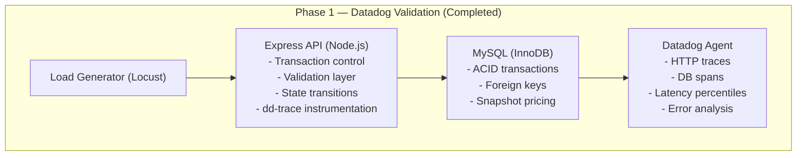
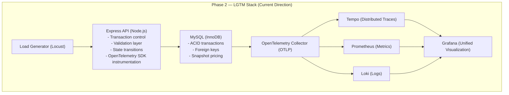

# Coffee Transaction Service

**Production-Style Order Processing API with Observability and Load
Modeling**

A transactional order service built with **Node.js (Express)** and
**MySQL**, validated under synthetic load, and instrumented first with
**Datadog APM**, now refactored to a **Grafana + OpenTelemetry (LGTM)
observability stack**.

------------------------------------------------------------------------

## Executive Summary

This service simulates a production-style commerce backend:

-   Product catalog (`coffee_table`)
-   Customer records (`customer_table`)
-   Order creation (`orders`)
-   Order line item snapshots (`order_items`)
-   Stateful order lifecycle transitions
-   Transactional integrity with rollback protection
-   Distributed tracing
-   Load validation via Locust

The system was initially validated using **Datadog APM** and is now
being migrated to an **OpenTelemetry-based LGTM stack (Loki, Grafana,
Tempo, Prometheus)** for vendor-neutral observability.

------------------------------------------------------------------------

## Observability Evolution

### Phase 1 --- Datadog APM (Completed)

-   HTTP request tracing via `dd-trace`
-   MySQL query spans
-   Transaction latency breakdown
-   P95 / P99 latency analysis
-   Error rate visibility
-   Load validation under 100+ concurrent users

This phase confirmed:

-   Stable transactional behavior
-   No 500-level failures under synthetic load
-   Clean rollback handling
-   Deterministic lifecycle transitions

### Phase 2 --- LGTM Stack (In Progress)

Refactoring to:

-   **OpenTelemetry SDK (Node)**
-   **OpenTelemetry Collector**
-   **Tempo** (distributed tracing backend)
-   **Prometheus** (metrics)
-   **Loki** (logs)
-   **Grafana** (visualization layer)

Goals of this pivot:

-   Vendor-neutral instrumentation
-   Standards-based telemetry (OTLP)
-   Self-hosted observability stack
-   Explicit control over trace/metric/log pipelines
-   Demonstration of modern cloud-native observability architecture

------------------------------------------------------------------------

## Architecture Overview

```text
## Architecture Overview

### Phase 1 — Datadog Validation (Completed)

Load Generator (Locust)
        │
        ▼
Express API (Node.js)
  - Transaction control
  - Validation layer
  - State transitions
  - `dd-trace` instrumentation
        │
        ▼
MySQL (InnoDB)
  - ACID transactions
  - Foreign keys
  - Snapshot pricing
        │
        ▼
Datadog Agent
  - HTTP traces
  - Database spans
  - Latency percentiles
  - Error analysis

---

### Phase 2 — LGTM Stack (Current Direction)

Load Generator (Locust)  
        │  
        ▼  
Express API (Node.js)  
  - Transaction control  
  - Validation layer  
  - State transitions  
  - OpenTelemetry SDK instrumentation  
        │  
        ▼  
MySQL (InnoDB)  
  - ACID transactions  
  - Foreign keys  
  - Snapshot pricing  
        │  
        ▼  
OpenTelemetry Collector (OTLP)  
        │  
        ├── Tempo (Distributed Traces)  
        ├── Prometheus (Metrics)  
        └── Loki (Logs)  
                │  
                ▼  
              Grafana (Unified Visualization)
Load Generator (Locust)
        │
        ▼
Express API (Node.js)
  - Transaction control
  - Validation layer
  - State transitions
  - dd-trace instrumentation
        │
        ▼
MySQL (InnoDB)
  - ACID transactions
  - Foreign keys
  - Snapshot pricing
        │
        ▼
Datadog Agent (APM)
  - HTTP traces
  - DB spans
  - Latency percentiles
  - Error analysis
```

------------------------------------------------------------------------

### Phase 1 - DataDog O11y Stack


### Phase 2 - LGTM Stack



## Core Domain Model

### Orders

-   Unique `order_number` (CHAR(26))
-   Monetary fields: `subtotal`, `tax`, `grand_total`
-   Status state machine
-   Transactionally consistent creation

### Order Items

-   Unit price snapshot at time of purchase
-   Line total preserved
-   Referential integrity to `orders`

------------------------------------------------------------------------

## Order Lifecycle

PENDING → PAID → FULFILLED → REFUNDED\
      ↘ CANCELLED

Load tests simulate probabilistic lifecycle transitions to reflect
real-world commerce behavior.

------------------------------------------------------------------------

## API Surface

  Method   Endpoint            Description
  -------- ------------------- ----------------------------
  GET      /health             Health check
  GET      /coffees            Product catalog
  GET      /users              Customer list
  POST     /order              Create transactional order
  PATCH    /order/:id/status   Update order state

------------------------------------------------------------------------

## Transaction Design

Order creation executes inside a database transaction:

1.  Validate customer exists\
2.  Validate coffee exists + fetch price\
3.  Compute totals\
4.  Insert order\
5.  Insert order items\
6.  Commit\
7.  Rollback on any failure

This ensures atomicity, consistency, and monetary integrity.

------------------------------------------------------------------------

## Load Testing

Load tests reside in:

    test/performance/locustfile.py

Example headless run:

    python -m locust -f test/performance/locustfile.py \
      --headless -u 100 -r 10 -t 5m \
      --host http://127.0.0.1:8080

Where:

-   `-u` = concurrent users\
-   `-r` = ramp rate\
-   `-t` = duration

------------------------------------------------------------------------

## Sample Test Outcome (Datadog Phase)

-   \~16,000 synthetic orders generated
-   Multi-stage lifecycle updates
-   Zero 500-level failures
-   Stable P95 latency under 100 concurrent users
-   Clean rollback behavior on validation failures

------------------------------------------------------------------------

## Local Development

Start full stack (DB + API + LGTM stack):

    docker compose up --build

Health check:

    curl http://localhost:8080/health

Grafana:

    http://localhost:3001

------------------------------------------------------------------------

## Storage Management During Load Testing

Synthetic load generates:

-   1 row in `orders`
-   N rows in `order_items`
-   Multiple status updates

Reset test data:

    SET FOREIGN_KEY_CHECKS=0;
    TRUNCATE order_items;
    TRUNCATE orders;
    SET FOREIGN_KEY_CHECKS=1;

Or reset container + volume:

    docker compose down -v


