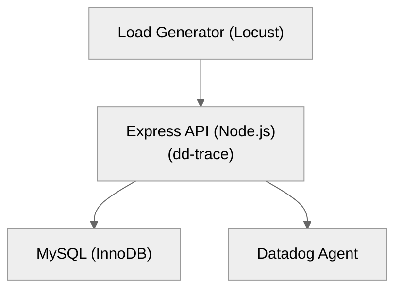
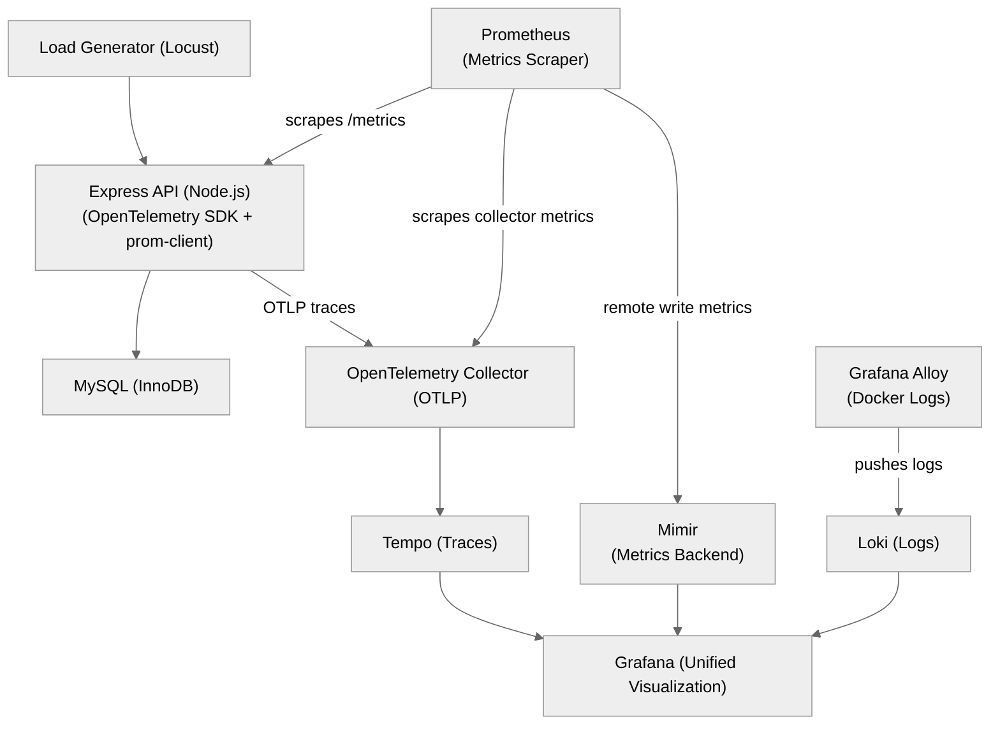

# Coffee Transaction Service

**Production-Style Order Processing API with Observability and Load
Modeling**

A transactional order service built with **Node.js (Express)** and
**MySQL**, validated under synthetic load, and instrumented first with
**Datadog APM**, now refactored to a **Grafana LGTM observability stack**
using OpenTelemetry, Prometheus metrics, and Grafana Alloy for Docker log
collection.

---

## Executive Summary

This service simulates a production-style commerce backend:

-   Product catalog (`coffee_table`)
-   Customer records (`customer_table`)
-   Order creation (`orders`)
-   Order line item snapshots (`order_items`)
-   Stateful order lifecycle transitions
-   Transactional integrity with rollback protection
-   Distributed tracing
-   Load validation via Locust

The system was initially validated using **Datadog APM** and is now
running on a self-hosted **LGTM stack (Loki, Grafana, Tempo, Prometheus)**.
The current local stack sends traces through the OpenTelemetry Collector,
exposes application metrics for Prometheus, and uses **Grafana Alloy** to
collect Docker container logs for Loki when the `loki` profile is enabled.

---

## Observability Evolution

### Phase 1 -- Datadog APM

-   HTTP request tracing via `dd-trace`
-   MySQL query spans
-   Transaction latency breakdown
-   P95 / P99 latency analysis
-   Error rate visibility
-   Load validation under 100+ concurrent users

This phase confirmed:

-   Stable transactional behavior
-   No 500-level failures under synthetic load
-   Clean rollback handling
-   Deterministic lifecycle transitions

### Phase 1 — Architecture

```mermaid
%%{init: {'theme':'neutral','themeVariables':{'fontSize':'16px'}}}%%
flowchart TD

L["Load Generator (Locust)"]
A["Express API (Node.js)<br/>(dd-trace)"]
D["MySQL (InnoDB)"]
G["Datadog Agent"]

L --> A
A --> D
A --> G
```

### Phase 2 -- LGTM Stack

Current observability components:

-   **OpenTelemetry SDK (Node)**
-   **OpenTelemetry Collector** for OTLP trace ingest and Tempo export
-   **prom-client** metrics exposed at `/metrics`
-   **Tempo** (distributed tracing backend)
-   **Prometheus** (metrics scraping)
-   **Mimir** (metrics backend)
-   **Loki** (logs)
-   **Grafana Alloy** (Docker log collection and Loki forwarding)
-   **Grafana** (visualization layer)

Goals of this pivot:

-   Vendor-neutral instrumentation
-   Standards-based telemetry (OTLP)
-   Self-hosted observability stack
-   Explicit control over trace, metric, and log pipelines
-   Demonstration of modern cloud-native observability architecture

### Phase 2 — LGTM Stack Architecture

```mermaid
%%{init: {'theme':'neutral','themeVariables':{'fontSize':'16px'}}}%%
flowchart TD

L["Load Generator (Locust)"]
A["Express API (Node.js)<br/>(OpenTelemetry SDK + prom-client)"]
D["MySQL (InnoDB)"]
C["OpenTelemetry Collector (OTLP)"]
T["Tempo (Traces)"]
P["Prometheus<br/>(Metrics Scraper)"]
M["Mimir<br/>(Metrics Backend)"]
K["Loki (Logs)"]
Y["Grafana Alloy<br/>(Docker Logs)"]
G["Grafana (Unified Visualization)"]

L --> A
A --> D
A -->|OTLP traces| C
P -->|scrapes /metrics| A
P -->|scrapes collector metrics| C
P -->|remote write metrics| M
Y -->|pushes logs| K

C --> T

T --> G
M --> G
K --> G
```

---

## Core Domain Model

### Orders

-   Unique `order_number` (CHAR(26))
-   Monetary fields: `subtotal`, `tax`, `grand_total`
-   Status state machine
-   Transactionally consistent creation

### Order Items

-   Unit price snapshot at time of purchase
-   Line total preserved
-   Referential integrity to `orders`

---

## Order Lifecycle

PENDING → PAID → FULFILLED → REFUNDED\
      ↘ CANCELLED

Load tests simulate probabilistic lifecycle transitions to reflect
real-world commerce behavior.

---

## API Surface

  Method   Endpoint            Description
  -------- ------------------- ----------------------------
  GET      /health             Health check
  GET      /metrics            Prometheus metrics
  GET      /coffees            Product catalog
  GET      /users              Customer list
  POST     /order              Create transactional order
  PATCH    /order/:id/status   Update order state

---

## Transaction Design

Order creation executes inside a database transaction:

1.  Validate customer exists\
2.  Validate coffee exists + fetch price\
3.  Compute totals\
4.  Insert order\
5.  Insert order items\
6.  Commit\
7.  Rollback on any failure

This ensures atomicity, consistency, and monetary integrity.

---

## Load Testing

Load tests reside in:

    test/performance/locustfile.py

Example headless run:

    python -m locust -f test/performance/locustfile.py \
      --headless -u 100 -r 10 -t 5m \
      --host http://127.0.0.1:8080

Where:

-   `-u` = concurrent users\
-   `-r` = ramp rate\
-   `-t` = duration

---

## Sample Test Outcome (Datadog Phase)

-   \~16,000 synthetic orders generated
-   Multi-stage lifecycle updates
-   Zero 500-level failures
-   Stable P95 latency under 100 concurrent users
-   Clean rollback behavior on validation failures

---

## Local Development

The local stack lives under [docker/](docker/) and is composed with Docker Compose.

Core services:

-   MySQL
-   Backend API
-   OpenTelemetry Collector
-   Tempo
-   Prometheus
-   Mimir
-   Grafana

Optional LGTM log services:

-   Loki
-   Grafana Alloy

Start the core stack:

    docker compose -f docker/docker-compose.yml up --build

Start the same stack with Loki and Grafana Alloy log collection:

    docker compose -f docker/docker-compose.yml --profile loki up --build

If you prefer the profile to be automatic, set `COMPOSE_PROFILES=loki` in [docker/.env](docker/.env) and run `docker compose up` from the [docker/](docker/) directory.

Stop and clean up the full stack:

    docker compose -f docker/docker-compose.yml down

If the `loki` profile is enabled via CLI or `.env`, the same `down` command will remove Loki and Alloy as well.

Health check:

    curl http://localhost:8080/health

Metrics endpoint:

    curl http://localhost:8080/metrics

Grafana:

    http://localhost:3001

Grafana Alloy UI (when the `loki` profile is enabled):

    http://localhost:12345

Grafana provisioning files:

-   [docker/grafana/provisioning/datasources/prometheus.yml](docker/grafana/provisioning/datasources/prometheus.yml) provisions Prometheus, Tempo, and Loki.
-   [docker/grafana/provisioning/datasources/mimir.yml](docker/grafana/provisioning/datasources/mimir.yml) provisions the separate Mimir datasource.

Datasource behavior:

-   Prometheus is the default Grafana datasource.
-   Mimir is kept separate so it can use `httpMethod: POST` and its own query interval.

Mimir configuration:

-   [docker/mimir/config.yml](docker/mimir/config.yml) is a single-binary local config using filesystem storage.
-   The config keeps ring and replication settings on the component-specific blocks, not under `common`.

Prometheus configuration:

-   [docker/prometheus/prometheus.yml](docker/prometheus/prometheus.yml) remote-writes to Mimir.
-   It also scrapes Prometheus itself, the OpenTelemetry Collector, the backend, and Mimir's operational metrics.
-   External labels are set for local Docker attribution.

Compose cleanup note:

-   Loki and Alloy are controlled by the `loki` profile.
-   To avoid orphaned containers, use the same profile setting for both `up` and `down`.

---

## Storage Management During Load Testing

Synthetic load generates:

-   1 row in `orders`
-   N rows in `order_items`
-   Multiple status updates

Reset test data:

    SET FOREIGN_KEY_CHECKS=0;
    TRUNCATE order_items;
    TRUNCATE orders;
    SET FOREIGN_KEY_CHECKS=1;

Or reset container + volume:

    docker compose -f docker/docker-compose.yml down -v

---

MIT License

Copyright (c) 2025 Eric Nelson

v2.4
